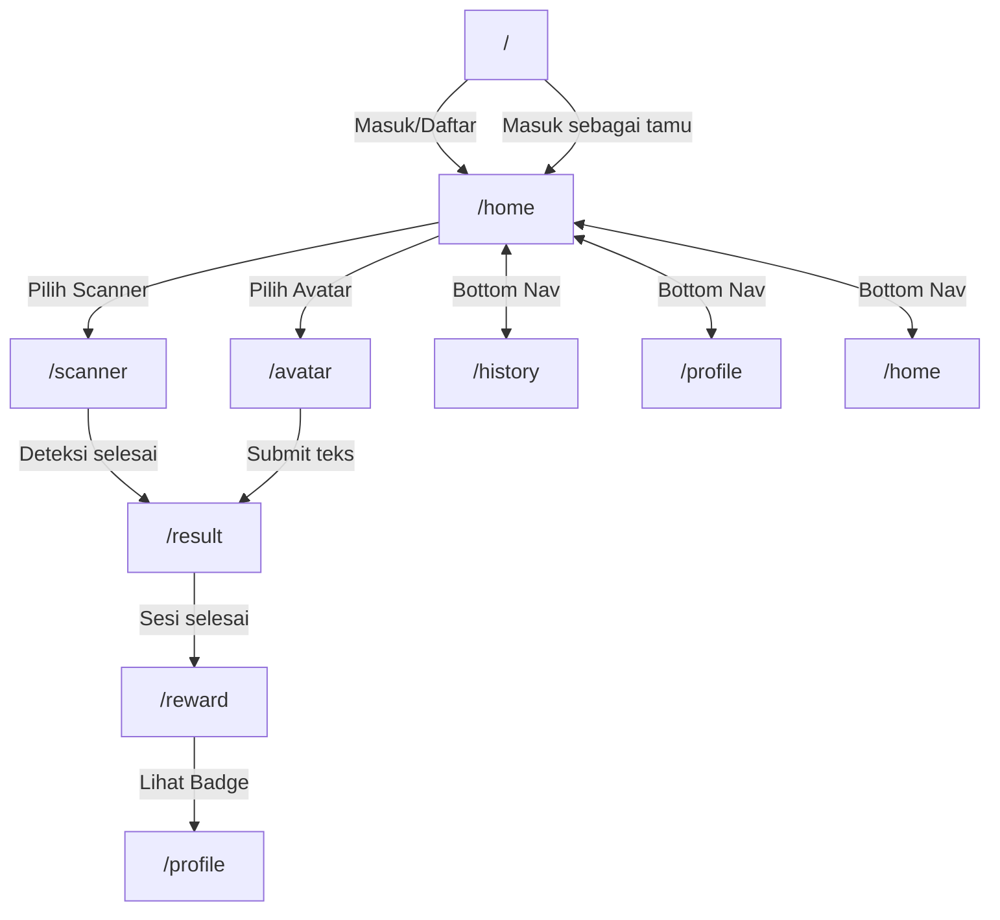

# Design Document: Selaras Platform

## Overview

Selaras adalah aplikasi web inklusif berbasis AI untuk pendidikan yang memungkinkan komunikasi setara antara guru, siswa tunarungu/gangguan pendengaran, dan teman sekelas. Aplikasi ini dibangun sebagai *frontend-only* menggunakan Next.js 15 App Router, React 19, TypeScript, Tailwind CSS, shadcn/ui, Framer Motion, React Hook Form, dan Zod — tanpa backend nyata, seluruh data menggunakan mock statis.

Dua mode komunikasi utama:
- **Scanner** — mendeteksi bahasa isyarat via kamera perangkat dan menghasilkan teks terjemahan (simulasi)
- **Avatar** — mengkonversi teks/suara guru menjadi avatar digital yang memperagakan bahasa isyarat

Sistem gamifikasi (poin, badge, streak, XP) memotivasi pengguna untuk konsisten berlatih.

**Prinsip desain teknis:**
- Mobile-first, responsif di 360px–1024px+
- Server Components secara default; `"use client"` hanya bila diperlukan
- Tailwind CSS sebagai satu-satunya metode styling
- Seluruh tipe TypeScript terpusat di `src/types/`
- Tidak ada external state library — React state + Context API

---

## Architecture

### Stack

| Layer | Teknologi |
|---|---|
| Framework | Next.js 15 (App Router) |
| UI Library | React 19 + TypeScript |
| Styling | Tailwind CSS 3 (custom tokens) |
| Components | shadcn/ui (Radix UI based) |
| Animation | Framer Motion |
| Forms | React Hook Form + Zod |
| Icons | Lucide React |
| Data | Mock data statis (src/lib/mock-data.ts) |
| Testing | Jest + React Testing Library + fast-check |

### App Router Structure

```
src/app/
├── layout.tsx              # Root layout (HTML shell, font, providers)
├── page.tsx                # / → Login/Splash screen
├── (app)/                  # Route group dengan AppLayout (bottom nav)
│   ├── layout.tsx          # AppLayout: wraps children + BottomNavigation
│   ├── home/
│   │   └── page.tsx        # /home → Pilih Mode Fitur
│   ├── scanner/
│   │   └── page.tsx        # /scanner → Mode Scanner
│   ├── avatar/
│   │   └── page.tsx        # /avatar → Mode Avatar
│   ├── result/
│   │   └── page.tsx        # /result → Hasil Terjemahan
│   ├── reward/
│   │   └── page.tsx        # /reward → Reward Screen
│   ├── history/
│   │   └── page.tsx        # /history → Riwayat
│   └── profile/
│       └── page.tsx        # /profile → Profil & Poin
└── not-found.tsx           # 404 halaman custom
```

**Rationale untuk route group `(app)/`**: Halaman login (`/`) tidak memerlukan Bottom Navigation. Dengan route group, AppLayout (yang menyertakan BottomNavigation) hanya diterapkan pada halaman-halaman di dalam group, tanpa mengubah URL path.

### Komponen Hierarchy

```
RootLayout (Server)
├── Providers (Client) — theme, user context
└── {children}
    ├── LoginPage (Server) — /
    └── AppLayout (Server)
        ├── BottomNavigation (Client) — usePathname
        └── {children}
            ├── HomePage (Server)
            │   └── ModeCards (Client) — onClick navigation
            ├── ScannerPage (Server shell)
            │   └── ScannerMode (Client) — camera API, useRef
            ├── AvatarPage (Server shell)
            │   └── AvatarMode (Client) — form state, animation
            ├── ResultPage (Server shell)
            │   └── ResultView (Client) — clipboard API
            ├── RewardPage (Server shell)
            │   └── RewardScreen (Client) — Framer Motion entrance
            ├── HistoryPage (Server shell)
            │   └── HistoryList (Client) — search, filter state
            └── ProfilePage (Server shell)
                └── ProfileView (Client) — settings panel
```

### State Management

Tidak menggunakan external state library. Strategi:

1. **React `useState` / `useReducer`** — state lokal per komponen (form input, filter aktif, loading state)
2. **React Context API** — state global:
   - `UserContext` — data profil, poin, XP, streak (di-seed dari mock data)
   - `HistoryContext` — daftar riwayat sesi (CRUD operations)
3. **URL state** — data hasil terjemahan di-passing via URL search params ke `/result` dan `/reward` untuk menghindari prop drilling antar navigasi
4. **localStorage** — persistensi ringan untuk guest mode flag (diakses hanya dalam `useEffect`)

```
src/
├── lib/
│   └── context/
│       ├── UserContext.tsx      # "use client" — user data + gamifikasi
│       └── HistoryContext.tsx   # "use client" — riwayat sesi
```

### Routing & Navigation Flow



---

## Components and Interfaces

### Folder Structure Lengkap

```
src/
├── app/                          # Next.js App Router
├── components/
│   ├── ui/                       # shadcn/ui generated (DO NOT modify)
│   │   ├── button.tsx
│   │   ├── card.tsx
│   │   ├── input.tsx
│   │   ├── progress.tsx
│   │   ├── tabs.tsx
│   │   ├── dropdown-menu.tsx
│   │   ├── badge.tsx
│   │   └── dialog.tsx
│   ├── layout/
│   │   ├── RootLayout.tsx        # HTML shell, font loader
│   │   └── AppLayout.tsx         # Wrapper with BottomNavigation
│   ├── cards/
│   │   ├── ModeCard.tsx          # Scanner/Avatar selection card
│   │   ├── StatCard.tsx          # Profil stat card (poin/badge/streak)
│   │   └── HistoryCard.tsx       # Riwayat item card
│   ├── forms/
│   │   ├── LoginForm.tsx         # "use client" — React Hook Form + Zod
│   │   └── AvatarInputForm.tsx   # "use client" — text/voice input
│   └── navigation/
│       └── BottomNavigation.tsx  # "use client" — usePathname active state
├── features/
│   ├── scanner/
│   │   ├── ScannerMode.tsx       # "use client" — camera, waveform
│   │   └── WaveformAnimation.tsx # "use client" — Framer Motion looping
│   ├── avatar/
│   │   ├── AvatarMode.tsx        # "use client" — form + avatar animation
│   │   └── AvatarAnimation.tsx   # "use client" — Framer Motion avatar
│   ├── result/
│   │   └── ResultView.tsx        # "use client" — clipboard API
│   ├── reward/
│   │   └── RewardScreen.tsx      # "use client" — Framer Motion entrance
│   ├── history/
│   │   └── HistoryList.tsx       # "use client" — search/filter state
│   └── profile/
│       └── ProfileView.tsx       # "use client" — settings panel
├── hooks/
│   ├── useCamera.ts              # Camera API hook (getUserMedia)
│   ├── useClipboard.ts           # Clipboard API hook
│   ├── useTTS.ts                 # Text-to-speech simulation hook
│   └── useReducedMotion.ts       # prefers-reduced-motion hook
├── lib/
│   ├── mock-data.ts              # Semua mock data
│   ├── utils.ts                  # shadcn cn() utility
│   ├── validations.ts            # Zod schemas
│   └── context/
│       ├── UserContext.tsx
│       └── HistoryContext.tsx
├── services/
│   └── translation.service.ts   # Mock translation logic
├── types/
│   ├── user.ts
│   ├── history.ts
│   ├── translation.ts
│   └── reward.ts
└── constants/
    ├── routes.ts                 # Route path constants
    ├── navigation.ts             # Bottom nav config
    └── gamification.ts          # Poin/XP constants
```

### Interface Komponen Utama

#### BottomNavigation

```typescript
// src/components/navigation/BottomNavigation.tsx
"use client"
// Props: none — reads active route from usePathname()
// Renders 4 tabs: Beranda, Riwayat, Poin, Profil
// Active tab detected by comparing pathname to route constants
```

#### ModeCard

```typescript
interface ModeCardProps {
  mode: "scanner" | "avatar";
  title: string;
  description: string;
  icon: React.ReactNode;
  href: string;
}
```

#### ScannerMode

```typescript
// "use client"
// Internal state: cameraState: "idle" | "requesting" | "active" | "error"
// Uses useCamera() hook for getUserMedia
// Renders: CameraView, LIVE badge, teal overlay, WaveformAnimation, status bar
```

#### AvatarInputForm

```typescript
interface AvatarInputFormProps {
  onSubmit: (text: string) => void;
}
// Zod schema: z.string().min(1).max(500)
// React Hook Form controller
```

#### HistoryList

```typescript
// "use client"
// Internal state: searchQuery, activeFilter, items (from HistoryContext)
// Filter logic: case-insensitive substring match on translationText
// Debounced search: 300ms
```

#### RewardScreen

```typescript
// "use client"
// Props: points: number, currentXP: number, targetXP: number
// Framer Motion variants: hidden (opacity:0, scale:0.8) → visible (opacity:1, scale:1.0)
// Duration: 400ms ease-out
```

---

## Data Models

### TypeScript Types (`src/types/`)

```typescript
// src/types/user.ts
export interface User {
  id: string;
  name: string;           // max 50 chars
  role: "siswa" | "guru" | "tamu";
  avatarUrl: string;
  totalPoints: number;    // integer ≥ 0
  badgeCount: number;     // integer ≥ 0
  streakDays: number;     // integer ≥ 0
  currentXP: number;      // 0 ≤ currentXP < nextLevelXP
  nextLevelXP: number;    // integer > 0
  badges: Badge[];
}

export interface Badge {
  id: string;
  name: string;
  iconUrl: string;
  earnedAt: string;       // ISO 8601
}
```

```typescript
// src/types/history.ts
export interface HistoryItem {
  id: string;
  translationText: string;  // max 200 chars (full), displayed max 100
  mode: "scanner" | "avatar";
  timestamp: string;         // ISO 8601 → displayed as DD/MM/YYYY HH:MM
  isStarred: boolean;
}
```

```typescript
// src/types/translation.ts
export interface TranslationResult {
  id: string;
  sourceMode: "scanner" | "avatar";
  translatedText: string;   // max 200 chars
  signAnimationId: string;  // references mock animation sequence
  audioDuration: number;    // ms
  pointsEarned: number;     // 1–999
}
```

```typescript
// src/types/reward.ts
export interface RewardData {
  pointsEarned: number;     // 1–999
  currentXP: number;
  nextLevelXP: number;
  message: string;
}
```

### Mock Data (`src/lib/mock-data.ts`)

```typescript
// src/lib/mock-data.ts
export const MOCK_USER: User = {
  id: "user-001",
  name: "Alya",
  role: "siswa",
  avatarUrl: "/images/avatar-alya.png",
  totalPoints: 350,
  badgeCount: 12,
  streakDays: 7,
  currentXP: 350,
  nextLevelXP: 500,
  badges: [ /* array of Badge */ ],
};

export const MOCK_HISTORY: HistoryItem[] = [
  {
    id: "hist-001",
    translationText: "Selamat pagi, apa kabar?",
    mode: "scanner",
    timestamp: "2025-01-15T08:30:00Z",
    isStarred: true,
  },
  {
    id: "hist-002",
    translationText: "Tolong buka halaman tiga belas",
    mode: "avatar",
    timestamp: "2025-01-15T09:15:00Z",
    isStarred: false,
  },
  {
    id: "hist-003",
    translationText: "Terima kasih sudah membantu saya",
    mode: "scanner",
    timestamp: "2025-01-14T14:20:00Z",
    isStarred: false,
  },
];

export const MOCK_TRANSLATIONS: TranslationResult[] = [
  {
    id: "trans-001",
    sourceMode: "scanner",
    translatedText: "Selamat pagi, apa kabar?",
    signAnimationId: "anim-morning-greeting",
    audioDuration: 2500,
    pointsEarned: 50,
  },
  // ...more entries
];

export const MOCK_AVATAR_RESPONSES: Record<string, string> = {
  "selamat pagi": "Selamat pagi! Semangat belajar hari ini.",
  "terima kasih": "Terima kasih kembali.",
  // fallback handled by service layer
};
```

### Tailwind Config — Custom Color Tokens

```typescript
// tailwind.config.ts
const config = {
  theme: {
    extend: {
      colors: {
        primary:    { DEFAULT: "#0F4C81", foreground: "#FFFFFF" },
        secondary:  { DEFAULT: "#2E8B57", foreground: "#FFFFFF" },
        accent:     { DEFAULT: "#FF9F1C", foreground: "#1A1A1A" },
        teal:       { DEFAULT: "#2EC4B6", foreground: "#FFFFFF" },
        background: "#F8F9FA",
        foreground: "#1A1A1A",
        surface:    "#FFFFFF",
      },
      fontFamily: {
        sans: ["Poppins", "sans-serif"],
      },
    },
  },
};
```

**Aturan penggunaan token**: Komponen HARUS menggunakan `bg-primary`, `text-secondary`, dst. — tidak boleh menggunakan nilai hex langsung di className.

### Constants

```typescript
// src/constants/routes.ts
export const ROUTES = {
  LOGIN:   "/",
  HOME:    "/home",
  SCANNER: "/scanner",
  AVATAR:  "/avatar",
  RESULT:  "/result",
  REWARD:  "/reward",
  HISTORY: "/history",
  PROFILE: "/profile",
} as const;

// src/constants/gamification.ts
export const POINTS_PER_SESSION = 50;
export const XP_PER_SESSION = 50;
export const STREAK_RESET_THRESHOLD_HOURS = 24;

// src/constants/navigation.ts
export const NAV_ITEMS = [
  { label: "Beranda",  href: ROUTES.HOME,    icon: "Home"  },
  { label: "Riwayat",  href: ROUTES.HISTORY, icon: "Clock" },
  { label: "Poin",     href: ROUTES.PROFILE, icon: "Gift"  },
  { label: "Profil",   href: ROUTES.PROFILE, icon: "User"  },
] as const;
```

### Zod Validation Schemas

```typescript
// src/lib/validations.ts
import { z } from "zod";

export const loginSchema = z.object({
  email:    z.string().email("Email tidak valid"),
  password: z.string().min(6, "Password minimal 6 karakter"),
});

export const avatarInputSchema = z.object({
  text: z.string()
    .min(1, "Teks tidak boleh kosong")
    .max(500, "Teks maksimal 500 karakter"),
});

export type LoginFormValues    = z.infer<typeof loginSchema>;
export type AvatarInputValues  = z.infer<typeof avatarInputSchema>;
```

---

## Correctness Properties

*A property is a characteristic or behavior that should hold true across all valid executions of a system — essentially, a formal statement about what the system should do. Properties serve as the bridge between human-readable specifications and machine-verifiable correctness guarantees.*

### Property 1: Validasi form login menolak input semua-whitespace

*For any* string yang terdiri seluruhnya dari karakter whitespace pada field email atau password, fungsi validasi Zod SHALL menolak input tersebut dan menghasilkan pesan error — tanpa memengaruhi nilai field lain yang sudah diisi.

**Validates: Requirements 1.7**

---

### Property 2: Filter riwayat adalah subset dari daftar lengkap

*For any* daftar riwayat dan filter mode yang dipilih ("scanner" atau "avatar"), semua item yang dikembalikan oleh fungsi filter SHALL memiliki field `mode` yang sama dengan filter yang dipilih; jumlah item hasil filter SHALL selalu ≤ jumlah item daftar lengkap.

**Validates: Requirements 6.3**

---

### Property 3: Pencarian riwayat bersifat case-insensitive dan menghasilkan subset

*For any* daftar riwayat dan query pencarian string, semua item yang dikembalikan oleh fungsi pencarian SHALL mengandung query (case-insensitive) pada field `translationText`; jumlah item hasil pencarian SHALL selalu ≤ jumlah item daftar lengkap.

**Validates: Requirements 6.5**

---

### Property 4: Round-trip serialisasi HistoryItem

*For any* objek `HistoryItem` yang valid, melakukan `JSON.stringify` kemudian `JSON.parse` SHALL menghasilkan objek yang ekuivalen (nilai field yang sama).

**Validates: Requirements 6.4, 11.4**

---

### Property 5: Validasi AvatarInput menolak string kosong dan melebihi batas

*For any* string input pada form Avatar, jika panjang string adalah 0 (atau semua whitespace) atau melebihi 500 karakter, maka fungsi validasi Zod SHALL menghasilkan error — dan fungsi SHALL menerima setiap string dengan panjang antara 1–500 karakter (non-whitespace).

**Validates: Requirements 12.1, 12.4**

---

### Property 6: Pemberian poin selalu dalam rentang valid

*For any* sesi terjemahan yang diselesaikan, nilai `pointsEarned` yang dikembalikan oleh service SHALL selalu berupa bilangan bulat dalam rentang 1–999.

**Validates: Requirements 5.3**

---

### Property 7: XP progress bar tidak pernah melebihi target

*For any* data pengguna yang valid, nilai `currentXP` SHALL selalu berada dalam rentang `0 ≤ currentXP ≤ nextLevelXP`, sehingga persentase progress bar selalu dalam rentang 0%–100%.

**Validates: Requirements 5.5, 7.3**

---

### Property 8: Animasi menghormati preferensi `prefers-reduced-motion`

*For any* animasi Framer Motion dalam aplikasi, jika hook `useReducedMotion()` mengembalikan `true`, maka durasi animasi yang dikonfigurasi SHALL selalu ≤ 50ms.

**Validates: Requirements 9.7**

---

### Property 9: Bottom Navigation menandai tepat satu tab aktif

*For any* pathname rute yang valid, fungsi `getActiveTab(pathname)` SHALL mengembalikan tepat satu tab aktif dari empat tab yang tersedia — tidak lebih dan tidak kurang.

**Validates: Requirements 8.2**

---

### Property 10: Penghapusan item riwayat mengurangi daftar tepat satu item

*For any* daftar riwayat dengan n item dan id item yang valid, setelah operasi hapus dijalankan, daftar hasil SHALL memiliki tepat n−1 item dan item dengan id tersebut SHALL tidak ada lagi dalam daftar.

**Validates: Requirements 6.9, 6.10**

---

## Error Handling

### Strategi Error Handling per Domain

#### Camera API (ScannerMode)

```typescript
// useCamera.ts
type CameraState =
  | { status: "idle" }
  | { status: "requesting" }
  | { status: "active"; stream: MediaStream }
  | { status: "error"; reason: "NotAllowed" | "NotFound" | "NotReadable" | "Unknown"; message: string };

// Pesan error per reason:
// NotAllowed  → "Izin kamera ditolak. Ketuk 'Coba Lagi' untuk mencoba lagi."
// NotFound    → "Kamera tidak ditemukan pada perangkat ini."
// NotReadable → "Kamera sedang digunakan aplikasi lain."
// Unknown     → "Kamera tidak dapat diakses. Coba Lagi."
```

- Tombol "Coba Lagi" re-triggers `getUserMedia` tanpa menyebabkan crash
- Jika kamera tetap gagal setelah retry, pesan error persisten ditampilkan (tidak crash, tidak navigasi)

#### Clipboard API (ResultView)

```typescript
// useClipboard.ts
type ClipboardState = "idle" | "copied" | "error";
// Error: fallback ke execCommand('copy') jika navigator.clipboard tidak tersedia
// Konfirmasi visual: icon check hijau selama 2 detik lalu kembali ke idle
```

#### Mock Data Failure (RewardScreen, ProfileView)

- Jika mock data tidak tersedia (undefined/null), komponen menampilkan `<ErrorBoundary>` lokal
- Pesan: "Data tidak dapat dimuat. Silakan refresh halaman."
- Tidak crash, tidak navigasi paksa

#### Form Validation (LoginForm, AvatarInputForm)

- Validasi real-time dengan React Hook Form + Zod
- Error message inline di bawah field yang gagal
- Field lain yang valid TIDAK direset
- Submit button disabled selama validasi gagal

#### Text-to-Speech Simulation (useTTS)

- Jika `MOCK_TTS_DATA` tidak tersedia: tampilkan toast/inline error "Audio tidak tersedia saat ini."
- Tidak menutup halaman, tidak crash

#### Navigation Guard

```typescript
// middleware.ts (Next.js)
// Jika tidak ada session dan route bukan "/" → redirect ke "/"
// Guest mode: flag tersimpan di sessionStorage, dicek dalam useEffect
```

### Error Boundary

```typescript
// src/components/layout/ErrorBoundary.tsx — "use client"
// Catches unhandled React errors per-subtree
// Renders fallback UI dengan tombol "Refresh"
// Digunakan sebagai wrapper di setiap feature component
```

---

## Testing Strategy

### Pendekatan Dual Testing

Testing menggunakan dua lapisan yang saling melengkapi:

1. **Unit Tests** (Jest + React Testing Library) — untuk contoh spesifik, edge case, dan error condition
2. **Property-Based Tests** (fast-check) — untuk properti universal yang harus berlaku di semua input

Kedua pendekatan diperlukan: unit test menemukan bug konkret, property test memverifikasi kebenaran umum.

### Property-Based Testing

Library yang digunakan: **[fast-check](https://fast-check.dev/)** — library PBT aktif untuk TypeScript/JavaScript.

Setiap property test dikonfigurasi minimum **100 iterasi** dan di-tag dengan komentar referensi:

```typescript
// Feature: selaras-platform, Property 1: Validasi form login menolak input semua-whitespace
```

#### Property Tests yang Diimplementasikan

Setiap property test berikut merujuk pada satu Correctness Property dari desain:

```typescript
// __tests__/properties/login-validation.property.test.ts
// Feature: selaras-platform, Property 1: Validasi form login menolak input semua-whitespace
it("menolak input whitespace-only", () => {
  fc.assert(
    fc.property(
      fc.string({ minLength: 1 }).filter(s => s.trim() === ""),
      (whitespaceStr) => {
        const result = loginSchema.safeParse({ email: whitespaceStr, password: "valid" });
        expect(result.success).toBe(false);
      }
    ),
    { numRuns: 100 }
  );
});

// __tests__/properties/history-filter.property.test.ts
// Feature: selaras-platform, Property 2: Filter riwayat adalah subset dari daftar lengkap
// Feature: selaras-platform, Property 3: Pencarian riwayat bersifat case-insensitive

// __tests__/properties/history-serialization.property.test.ts
// Feature: selaras-platform, Property 4: Round-trip serialisasi HistoryItem

// __tests__/properties/avatar-validation.property.test.ts
// Feature: selaras-platform, Property 5: Validasi AvatarInput menolak string kosong dan melebihi batas

// __tests__/properties/gamification.property.test.ts
// Feature: selaras-platform, Property 6: Pemberian poin selalu dalam rentang valid
// Feature: selaras-platform, Property 7: XP progress bar tidak pernah melebihi target

// __tests__/properties/animation.property.test.ts
// Feature: selaras-platform, Property 8: Animasi menghormati preferensi prefers-reduced-motion

// __tests__/properties/bottom-nav.property.test.ts
// Feature: selaras-platform, Property 9: Bottom Navigation menandai tepat satu tab aktif

// __tests__/properties/history-delete.property.test.ts
// Feature: selaras-platform, Property 10: Penghapusan item riwayat mengurangi daftar tepat satu item
```

### Unit Tests (React Testing Library)

Fokus unit test:
- **LoginPage**: render form, submit dengan data valid → navigasi, submit dengan data invalid → error message
- **ScannerMode**: render dengan camera state "error" → tampilkan error message + tombol Coba Lagi
- **HistoryList**: render dengan daftar kosong → tampilkan empty state
- **BottomNavigation**: render di setiap route → tab yang benar aktif
- **RewardScreen**: render dengan data mock → poin dan progress bar tampil benar
- **AvatarInputForm**: submit melebihi 500 karakter → error inline; submit teks valid → callback dipanggil

### Integration Tests

Fokus:
- Navigasi flow lengkap: Login → Home → Scanner → Result → Reward → Profile
- Context persistence: penambahan history item tersimpan di HistoryContext dan terlihat di HistoryList
- Camera permission flow: simulasi izin ditolak dan diterima

### Aksesibilitas Testing

- Semua komponen diuji dengan `axe-core` via `jest-axe` untuk mendeteksi pelanggaran WCAG otomatis
- Manual check: keyboard navigation flow pada setiap halaman
- Catatan: validasi penuh memerlukan pengujian manual dengan assistive technology (screen reader)

### Unit Testing Balance

- Hindari menulis terlalu banyak unit test untuk kasus yang sudah tercakup property test
- Unit test fokus pada: contoh konkret, integrasi antar komponen, conditional rendering
- Property test fokus pada: validasi input range, filter/search logic, data transformation, invariants gamifikasi

### Framer Motion Testing

- Untuk animasi, test memverifikasi bahwa Framer Motion `variants` object memiliki nilai yang benar (opacity, scale)
- Durasi `prefers-reduced-motion` diuji via Property 8 dengan mock `useReducedMotion`
- CLS testing: visual regression test atau manual Lighthouse audit (tidak otomatis via Jest)
